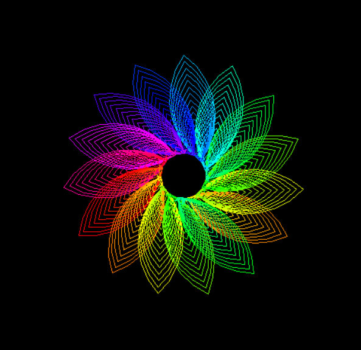

# 🌸 Python Turtle Art
A mesmerizing, mathematically-driven digital art piece created using Python's **Turtle Graphics** and the **Colorsys** library. This project generates a vibrant, multi-layered floral pattern with a dynamic HSV color gradient.

## 🎨 Preview
The script renders a complex, symmetric flower-like structure where each "petal" is drawn using nested circles and precise rotations, cycling through the entire color spectrum.

  

## 🚀 How It Works
* **Recursive-like Looping:** Nested `for` loops handle the repetition of petal layers.
* **HSV to RGB Conversion:** Uses `colorsys.hsv_to_rgb` to create a smooth, seamless rainbow transition.
* **Turtle Geometry:** Employs precise headings (`rt`, `lt`) and circle radii to create the organic symmetry.
* **Performance Optimization:** `tracer(10)` is used to speed up the animation by skipping frames, allowing the complex pattern to appear more quickly.

# A glimpse into the color logic
c = colorsys.hsv_to_rgb(h, 1, 1) 
color(c) 
h += 0.005 # Incremental shift in the color wheel
